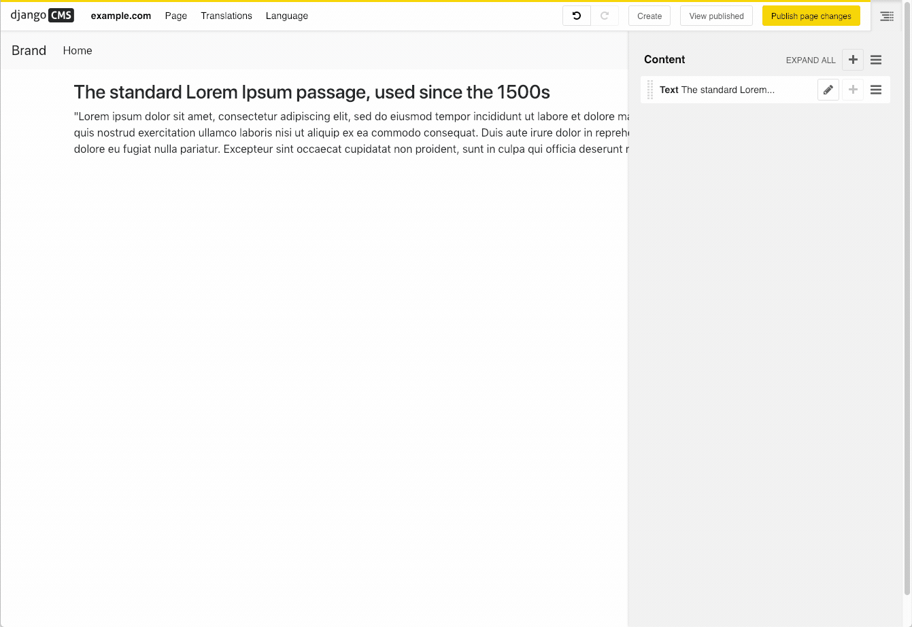

========================
django CMS Text CKEditor
========================

|pypi| |coverage| |python| |django| |djangocms| |djangocms4|

.. note::

        Version 5 of this package does not include a move to CKEditor version 5

CKEditor (v4) is a ready-for-use HTML text editor designed to simplify web content
creation. It's a WYSIWYG editor that brings common word processor features
directly to your web pages. Enhance your website experience with our community
maintained editor. This package aims to integrate CKEditor into django CMS as
a text plugin.

.. note::

        This project is endorsed by the `django CMS Association <https://www.django-cms.org/en/about-us/>`_.
        That means that it is officially accepted by the dCA as being in line with our roadmap vision and development/plugin policy.
        Join us on `Slack <https://www.django-cms.org/slack/>`_.

.. WARNING::

   - For django CMS 3.8.x+ use ``djangocms-text-ckeditor`` >= 4.x.x (e.g.: version 4.0.0).
   - For django CMS 3.4.x+ use ``djangocms-text-ckeditor`` >= 3.2.x (e.g.: version 3.2.1).

*******************************************
Contribute to this project and win rewards
*******************************************

Because this is a an open-source project, we welcome everyone to
`get involved in the project <https://www.django-cms.org/en/contribute/>`_ and
`receive a reward <https://www.django-cms.org/en/bounty-program/>`_ for their contribution.
Become part of a fantastic community and help us make django CMS the best CMS in the world.

We'll be delighted to receive your
feedback in the form of issues and pull requests. Before submitting your
pull request, please review our `contribution guidelines
<http://docs.django-cms.org/en/latest/contributing/index.html>`_.

We're grateful to all contributors who have helped create and maintain this package.
Contributors are listed at the `contributors <https://github.com/divio/djangocms-text-ckeditor/graphs/contributors>`_
section.

One of the easiest contributions you can make is helping to translate this addon on
`Transifex <https://www.transifex.com/projects/p/djangocms-text-ckeditor/>`_.

Documentation
=============

See ``REQUIREMENTS`` in the `setup.py <https://github.com/django-cms/djangocms-text-ckeditor/blob/master/setup.py>`_
file for additional dependencies listed in the

The current integrated Version of CKEditor is: **4.17.2**

For a full documentation visit: http://ckeditor.com/

Installation
------------

This plugin requires `django CMS` 3.4.5 or higher to be properly installed.

For a manual install:

* run ``pip install djangocms-text-ckeditor``
* add ``djangocms_text_ckeditor`` to your ``INSTALLED_APPS``
* run ``python manage.py migrate djangocms_text_ckeditor``

Upgrading from ``cms.plugins.text``
***********************************

* remove ``cms.plugins.text`` from ``INSTALLED_APPS``
* add ``djangocms_text_ckeditor`` to ``INSTALLED_APPS``
* run ``python manage.py migrate djangocms_text_ckeditor 0001 --fake``

Configuration
-------------

Inline editing feature
**********************

Inline editing allows editors to directly click on a text plugin and change
the contents in django CMS' edit mode. The CKEditor appears directly around
the text field and can be used normally. Changes are saved as soon as the
text field leaves focus.

Inline editing requires to encapsulate the HTML text in a ``
`` in
edit mode. This might cause some side effects with a site's CSS, e.g. direct
child rules.

To activate inline editing add the following line in your project's
``settings.py``::

    TEXT_INLINE_EDITING = True

This will add a toggle button to the toolbar to allow to switch inline editing
on and off for the current session.

When inline editing is active the editor will save the plugin's content each time it loses
focus. If only text has changed the user can immediately continue to edit. If
a text-enabled plugin was changed, added, or removed he page will refresh to
update the page tree and get the correctly rendered version of the changed
plugin.

Default content in Placeholder
******************************

If you use Django-CMS >= 3.0, you can use ``TextPlugin`` in "default_plugins"
(see docs about the `CMS_PLACEHOLDER_CONF`_ setting in Django CMS 3.0).
``TextPlugin`` requires just one value: ``body`` where you write your default
HTML content. If you want to add some "default children" to your
automagically added plugin (i.e. a ``LinkPlugin``), you have to put children
references in the body. References are ``"%(_tag_child_<order>)s"`` with the
inserted order of children. For example::

    CMS_PLACEHOLDER_CONF = {
        'content': {
            'name' : _('Content'),
            'plugins': ['TextPlugin', 'LinkPlugin'],
            'default_plugins':[
                {
                    'plugin_type':'TextPlugin',
                    'values':{
                        'body':'
Great websites : %(_tag_child_1)s and %(_tag_child_2)s
'
                    },
                    'children':[
                        {
                            'plugin_type':'LinkPlugin',
                            'values':{
                                'name':'django',
                                'url':'https://www.djangoproject.com/'
                            },
                        },
                        {
                            'plugin_type':'LinkPlugin',
                            'values':{
                                'name':'django-cms',
                                'url':'https://www.django-cms.org'
                            },
                        },
                    ]
                },
            ]
        }
    }

.. _CMS_PLACEHOLDER_CONF: http://docs.django-cms.org/en/latest/how_to/placeholders.html?highlight=cms_placeholder_conf

CKEDITOR_SETTINGS
*****************

You can override the setting ``CKEDITOR_SETTINGS`` in your settings.py::

    CKEDITOR_SETTINGS = {
        'language': '{{ language }}',
        'toolbar': 'CMS',
        'skin': 'moono-lisa',
    }

This is the default dict that holds all **CKEditor** settings.

Customizing plugin editor
#########################

To customize the plugin editor, use `toolbar_CMS` attribute, as in::

    CKEDITOR_SETTINGS = {
        'language': '{{ language }}',
        'toolbar_CMS': [
            ['Undo', 'Redo'],
            ['cmsplugins', '-', 'ShowBlocks'],
            ['Format', 'Styles'],
        ],
        'skin': 'moono-lisa',
    }

Customizing HTMLField editor
############################

If you use ``HTMLField`` from ``djangocms_text_ckeditor.fields`` in your own
models, use `toolbar_HTMLField` attribute::

    CKEDITOR_SETTINGS = {
        'language': '{{ language }}',
        'toolbar_HTMLField': [
            ['Undo', 'Redo'],
            ['ShowBlocks'],
            ['Format', 'Styles'],
        ],
        'skin': 'moono-lisa',
    }

You can further customize each `HTMLField` field by using different
configuration parameter in your settings::

    models.py

    class Model1(models.Model):
        text = HTMLField(configuration='CKEDITOR_SETTINGS_MODEL1')

    class Model2(models.Model):
        text = HTMLField(configuration='CKEDITOR_SETTINGS_MODEL2')

    settings.py

    CKEDITOR_SETTINGS_MODEL1 = {
        'toolbar_HTMLField': [
            ['Undo', 'Redo'],
            ['ShowBlocks'],
            ['Format', 'Styles'],
            ['Bold', 'Italic', 'Underline', '-', 'Subscript', 'Superscript', '-', 'RemoveFormat'],
        ]
    }

    CKEDITOR_SETTINGS_MODEL2 = {
        'toolbar_HTMLField': [
            ['Undo', 'Redo'],
            ['Bold', 'Italic', 'Underline', '-', 'Subscript', 'Superscript', '-', 'RemoveFormat'],
        ]
    }

#. Add `configuration='MYSETTING'` to the `HTMLField` usage(s) you want to
   customize;
#. Define a setting parameter named as the string used in the `configuration`
   argument of the `HTMLField` instance with the desired configuration;

Values not specified in your custom configuration will be taken from the global
``CKEDITOR_SETTINGS``.

For an  overview of all the available settings have a look here:

http://docs.ckeditor.com/#!/api/CKEDITOR.config

Inline preview
--------------

The child plugins of TextPlugin can be rendered directly inside CKEditor if
``text_editor_preview`` isn't ``False``. However there are few important points
to note:

- by default CKEditor doesn't load CSS of your project inside the editing area
  and has specific settings regarding empty tags, which could mean that things
  will not look as they should until CKEditor is configured correctly.

  See examples:

    - `add styles and js configuration`_
    - `stop CKEditor from removing empty spans`_ (useful for iconfonts)

- if you override widget default behaviour - be aware that it requires the
  property "`allowedContent`_" `to contain`_ ``cms-plugin[*]`` as this custom tag is
  what allows the inline previews to be rendered

- Important note: please avoid html tags in ``__str__`` representation of text
  enabled plugins - this messes up inline preview.

- If you're adding a Text Plugin as a child inside another plugin and want to style it
  conditionally based on the parent - you can add ``CMSPluginBase.child_ckeditor_body_css_class``
  attribute to the parent class.

.. _add styles and js configuration: https://github.com/divio/django-cms-demo/blob/7a104acaa749c52a8ed4870a74898e38daf20e46/src/settings.py#L318-L324
.. _stop CKEditor from removing empty spans: https://github.com/divio/django-cms-explorer/blob/908a88afa4e1d1176e267e77eb5c61e31ef0f9e5/static/js/addons/ckeditor.wysiwyg.js#L73
.. _allowedContent: http://docs.ckeditor.com/#!/guide/dev_allowed_content_rules
.. _to contain: https://github.com/django-cms/djangocms-text-ckeditor/issues/405#issuecomment-276814197

Drag & Drop Images
------------------

In IE and Firefox based browsers it is possible to drag and drop a picture into the text editor.
This image is base64 encoded and lives in the 'src' attribute as a 'data' tag.

We detect this images, encode them and convert them to picture plugins.
If you want to overwrite this behavior for your own picture plugin:

There is a setting called::

    TEXT_SAVE_IMAGE_FUNCTION = 'djangocms_text_ckeditor.picture_save.create_picture_plugin'

you can overwrite this setting in your settings.py and point it to a function that handles image saves.
Have a look at the function ``create_picture_plugin`` for details.

To completely disable the feature, set ``TEXT_SAVE_IMAGE_FUNCTION = None``.

Usage as a model field
----------------------

If you want to use the widget on your own model fields, you can! Just import the provided ``HTMLField`` like so::

    from djangocms_text_ckeditor.fields import HTMLField

And use it in your models, just like a ``TextField``::

    class MyModel(models.Model):
        myfield = HTMLField(blank=True)

This field does not allow you to embed any other CMS plugins within the text editor. Plugins can only be embedded
within ``Placeholder`` fields.

If you need to allow additional plugins to be embedded in a HTML field, convert the ``HTMLField`` to a ``Placeholderfield``
and configure the placeholder to only accept TextPlugin. For more information on using placeholders outside of the CMS see:

http://docs.django-cms.org/en/latest/how_to/placeholders.html

Auto Hyphenate Text
-------------------

You can hyphenate the text entered into the editor, so that the HTML entity ``&shy;`` (soft-hyphen_)
automatically is added in between words, at the correct syllable boundary.

To activate this feature, ``pip install django-softhyphen``. In ``settings.py`` add ``'softhyphen'``
to the list of ``INSTALLED_APPS``. django-softhyphen_ also installs hyphening dictionaries for 25
natural languages.

In case you already installed ``django-softhyphen`` but do not want to soft hyphenate, set
``TEXT_AUTO_HYPHENATE`` to ``False``.

.. _soft-hyphen: http://www.w3.org/TR/html4/struct/text.html#h-9.3.3
.. _django-softhyphen: https://github.com/datadesk/django-softhyphen

Extending the plugin
--------------------

.. NOTE::
    Added in version 2.0.1

You can use this plugin as base to create your own CKEditor-based plugins.

You need to create your own plugin model extending ``AbstractText``::

    from djangocms_text_ckeditor.models import AbstractText

    class MyTextModel(AbstractText):
        title = models.CharField(max_length=100)

and a plugin class extending ``TextPlugin`` class::

    from djangocms_text_ckeditor.cms_plugins import TextPlugin
    from .models import MyTextModel

    class MyTextPlugin(TextPlugin):
        name = _(u"My text plugin")
        model = MyTextModel

    plugin_pool.register_plugin(MyTextPlugin)

Note that if you override the `render` method that is inherited from the base ``TextPlugin`` class, any child text
plugins will not render correctly. You must call the super ``render`` method in order for ``plugin_tags_to_user_html()``
to render out all child plugins located in the ``body`` field. For example::

    from djangocms_text_ckeditor.cms_plugins import TextPlugin
    from .models import MyTextModel

    class MyTextPlugin(TextPlugin):
        name = _(u"My text plugin")
        model = MyTextModel

        def render(self, context, instance, placeholder):
            context.update({
                'name': instance.name,
            })
            # Other custom render code you may have
        return super().render(context, instance, placeholder)

    plugin_pool.register_plugin(MyTextPlugin)

You can further `customize your plugin`_ as other plugins.

.. _customize your plugin: http://docs.django-cms.org/en/latest/how_to/custom_plugins.html

Adding plugins to the "CMS Plugins" dropdown
--------------------------------------------

If you have created a plugin that you want to use within Text plugins you can make them appear in the dropdown by
making them `text_enabled`. This means that you assign the property ``text_enabled`` of a plugin to ``True``,
the default value is `False`. Here is a very simple implementation::

    class MyTextPlugin(TextPlugin):
        name = "My text plugin"
        model = MyTextModel
        text_enabled = True

When the plugin is picked up, it will be available in the *CMS Plugins* dropdown, which you can find in the editor.
This makes it very easy for users to insert special content in a user-friendly Text block, which they are familiair with.

The plugin will even be previewed in the text editor. **Pro-tip**: make sure your plugin provides its own `icon_alt` method.
That way, if you have many `text_enabled`-plugins, it can display a hint about it. For example, if you created a plugin which displays prices of configurable product, it can display a tooltip with the name of that product.

For more information about extending the CMS with plugins, read `django-cms doc`_ on how to do this.

.. _django-cms doc: http://docs.django-cms.org/en/latest/reference/plugins.html#cms.plugin_base.CMSPluginBase.text_enabled

Configurable sanitizer
----------------------

``djangocms-text-ckeditor`` uses `html5lib`_ to sanitize HTML to avoid
security issues and to check for correct HTML code.
Sanitisation may strip tags usesful for some use cases such as ``iframe``;
you may customize the tags and attributes allowed by overriding the
``TEXT_ADDITIONAL_TAGS`` and ``TEXT_ADDITIONAL_ATTRIBUTES`` settings::

    TEXT_ADDITIONAL_TAGS = ('iframe',)
    TEXT_ADDITIONAL_ATTRIBUTES = ('scrolling', 'allowfullscreen', 'frameborder')

In case you need more control on sanitisation you can extend AllowTokenParser class and define
your logic into parse() method. For example, if you want to skip your donut attribute during
sanitisation, you can create a class like this::

    from djangocms_text_ckeditor.sanitizer import AllowTokenParser

    class DonutAttributeParser(AllowTokenParser):

        def parse(self, attribute, val):
            return attribute.startswith('donut-')

And add your class to ``ALLOW_TOKEN_PARSERS`` settings::

    ALLOW_TOKEN_PARSERS = (
        'mymodule.DonutAttributeParser',
    )

**NOTE**: Some versions of CKEditor will pre-sanitize your text before passing it to the web server,
rendering the above settings useless. To ensure this does not happen, you may need to add the
following parameters to ``CKEDITOR_SETTINGS``::

      ...
      'basicEntities': False,
      'entities': False,
      ...

To completely disable the feature, set ``TEXT_HTML_SANITIZE = False``.

See the `html5lib documentation`_ for further information.

.. _html5lib: https://pypi.python.org/pypi/html5lib
.. _html5lib documentation: https://code.google.com/p/html5lib/wiki/UserDocumentation#Sanitizing_Tokenizer

Search
------

djangocms-text-ckeditor works well with `aldryn-search <https://github.com/aldryn/aldryn-search>`_
to make text content using Haystack.

Development
===========

pre-commit hooks
----------------

The repo uses pre-commit git hooks to run tools which ensure code quality.

To utilise this, run ``pip install pre-commit`` and then ``pre-commit install``.

Building the JavaScript
-----------------------

``djangocms-text-ckeditor`` distributes a javascript bundle required for the
plugin to work, which contains CKEditor itself and all the necessary plugins for
functioning within CMS. To build the bundle you need to have to install
dependencies with ``npm install`` and then to run ``gulp bundle``.

This command also updates the file name loaded based on the file contents.

Updating the CKEditor
---------------------

Make sure to use the url in `build config <https://github.com/divio/djangocms-text-ckeditor/blob/master/djangocms_text_ckeditor/static/djangocms_text_ckeditor/ckeditor/build-config.js#L16>`_.

Running Tests
-------------

You can run tests by executing::

    virtualenv env
    source env/bin/activate
    pip install -r tests/requirements.txt
    python setup.py test

.. |pypi| image:: https://badge.fury.io/py/djangocms-text-ckeditor.svg
    :target: http://badge.fury.io/py/djangocms-text-ckeditor
.. |build| image:: https://travis-ci.org/divio/djangocms-text-ckeditor.svg?branch=master
    :target: https://travis-ci.org/divio/djangocms-text-ckeditor
.. |coverage| image:: https://codecov.io/gh/django-cms/djangocms-text-ckeditor/branch/master/graph/badge.svg
    :target: https://codecov.io/gh/django-cms/djangocms-text-ckeditor
.. |python| image:: https://img.shields.io/badge/python-3.7+-blue.svg
    :target: https://pypi.org/project/djangocms-text-ckeditor/
.. |django| image:: https://img.shields.io/badge/django-2.2--5.0-blue.svg
    :target: https://www.djangoproject.com/
.. |djangocms| image:: https://img.shields.io/badge/django%20CMS-3.7%2B-blue.svg
    :target: https://www.django-cms.org/
.. |djangocms4| image:: https://img.shields.io/badge/django%20CMS-4-blue.svg
    :target: https://www.django-cms.org/
